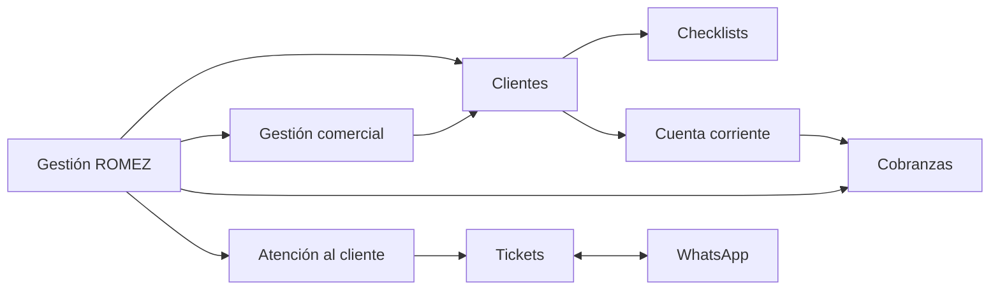

# Gestión ROMEZ

Vault canónico de la plataforma interna de ROMEZ Servicios Contables, preparada para Paraguay y un equipo de aproximadamente 15 personas.

## Navegación

- [[01 - Producto y navegacion|Producto y navegación]]
- [[02 - Arquitectura y API|Arquitectura y API]]
- [[03 - Modelo de datos|Modelo de datos]]
- [[04 - Permisos y responsables|Permisos y responsables]]
- [[05 - Tickets y WhatsApp|Tickets y WhatsApp]]
- [[06 - Cobranzas|Cobranzas]]
- [[07 - Clientes y checklists|Clientes y checklists]]
- [[08 - Despliegue|Despliegue]]
- [[09 - Respaldo y restauracion|Respaldo y restauración]]
- [[10 - Verificacion y estado|Verificación y estado]]
- [[11 - Integraciones y seguridad|Integraciones y seguridad]]

## Mapa general

## Reglas de producto

- La interfaz usa la marca **Gestión ROMEZ**. `crm` se conserva sólo en identificadores técnicos compatibles.
- Moneda predeterminada: PYG. Otras monedas se contabilizan por separado, sin conversión automática.
- Formato: `es-PY`. Zona horaria: `America/Asuncion`.
- Autoridad tributaria de referencia: [DNIT](https://www.dnit.gov.py/). Marangatu es externo; no se almacenan sus credenciales.
- Existe un solo WhatsApp compartido. Cada cliente, contacto, oportunidad y ticket puede tener responsable.
- Registro público deshabilitado. El owner inicial se crea únicamente con variables `ROMEZ_OWNER_*`.

> [!danger]
> Nunca pegar secretos, archivos de sesión de WhatsApp, dumps, medios de clientes ni credenciales tributarias en este vault.
