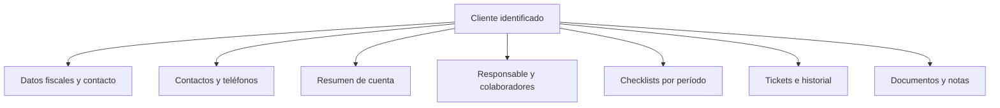

# Producto y navegación

Volver a [[00 - Inicio]].

Gestión ROMEZ funciona como un legajo contable digital: el nombre del cliente, su responsable, estado y deuda deben permanecer visibles durante la operación.

## Secciones

| Sección | Objetivo |
|---|---|
| Inicio | Vencidos, tickets libres, checklists próximos, cartera y actividad comercial |
| Clientes | Búsqueda masiva por nombre, RUC/DV, teléfono, responsable, deuda y pendientes |
| Gestión comercial | Embudo de oportunidades y conversión de una ganada en cliente |
| Gestión de cobranzas | Cargos, pagos, cuenta corriente, vencidos e importaciones |
| Atención al cliente | Carga, pendientes, tiempos de respuesta y estado del WhatsApp |
| Tickets | Bandejas Libres, Míos y Todos según rol |
| Configuración | Equipo e integraciones técnicas sólo para roles autorizados |

## Ficha del cliente

## Identidad visual

- Logo claro: login y superficies blancas.
- Logo azul oscuro: menú lateral y navegación móvil.
- Logo azul intermedio: recurso secundario.
- Paleta: azul marino, azul ROMEZ y superficies claras.
- Atribución visible: **Desarrollado por Consultoría Digital**.

Stock y registro público no forman parte de la navegación. API keys, webhooks y equipo se ubican dentro de Configuración y dependen del rol.
