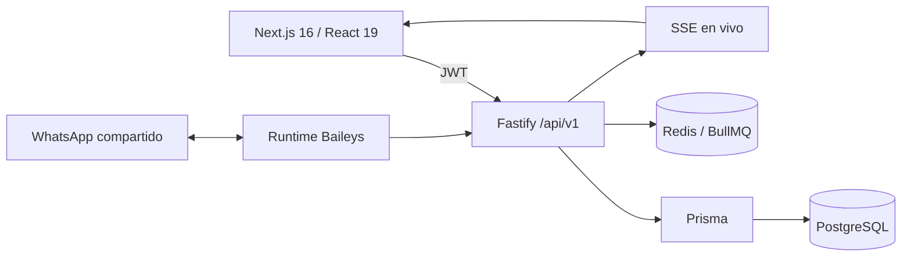

# Arquitectura y API

Relacionado con [[03 - Modelo de datos]], [[04 - Permisos y responsables]] y [[08 - Despliegue]].

## Límites

- `workspaceId` separa todos los datos.
- El backend es la autoridad de permisos; ocultar un menú no concede ni quita acceso.
- JWT autentica personas. `X-API-Key` queda reservado para integraciones autorizadas.
- La sesión web vive en `localStorage`; no hay autenticación SSR ni cookies.
- WhatsApp mantiene estado local, por eso producción usa un solo proceso backend.

## API principal

| Prefijo | Uso |
|---|---|
| `/auth` | Login, sesión, recuperación, equipo y bootstrap controlado |
| `/clients` | Clientes, importación y resumen integral |
| `/collections` | Cargos, pagos, cuenta corriente e importación |
| `/checklist-templates` | Plantillas contables |
| `/clients/:id/checklists` | Instancias por cliente y período |
| `/tickets` | Bandejas, asignación atómica, estado, comentarios y respuesta |
| `/customer-service/summary` | Métricas operativas y salud de WhatsApp |
| `/deals`, `/pipelines` | Gestión comercial compatible |
| `/contacts`, `/whatsapp` | Personas, teléfonos, chats y compatibilidad existente |

## Eventos en vivo

- `ticket.created`
- `ticket.updated`
- `collection.updated`
- `checklist.updated`

También se conservan los eventos existentes de contactos, oportunidades, mensajes y asignaciones.
