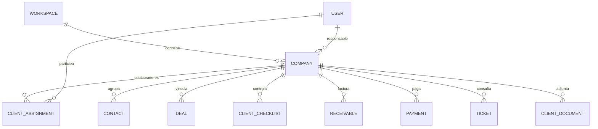
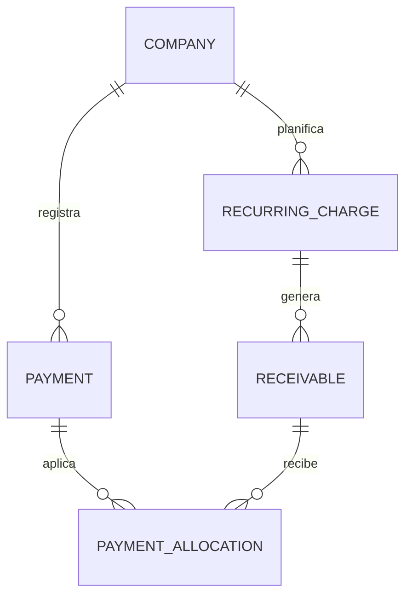
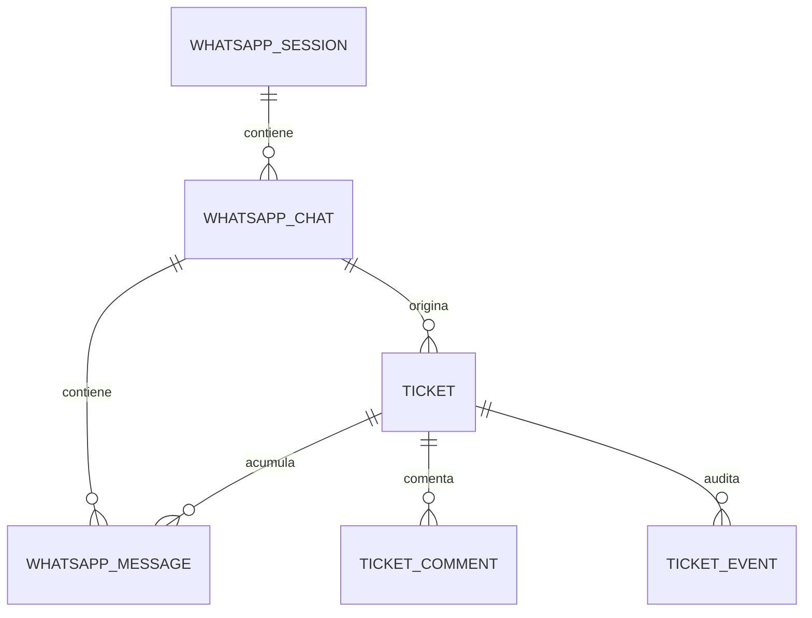

# Modelo de datos

La fuente ejecutable es `backend/prisma/schema.prisma`.

## Cliente y operación

`Company` sigue siendo el nombre técnico por compatibilidad y se expone como `Client`. Contiene persona física/jurídica, RUC, DV, razón social, nombre comercial, actividad, obligaciones, domicilio, estado y responsable.

## Cobranzas

- Importes con `Decimal(18,2)`.
- Unicidad por plan y período para generar honorarios de forma idempotente.
- Estados: pendiente, parcial, pagado, vencido y anulado.
- Cada moneda mantiene su propio saldo.

## Tickets

`activeKey` asegura un solo ticket activo por conversación. Al resolver o cerrar se libera; el siguiente mensaje entrante puede crear un ticket nuevo.
