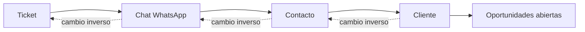

# Permisos y responsables

Relacionado con [[05 - Tickets y WhatsApp]] y [[07 - Clientes y checklists]].

| Acción | owner | admin | member | viewer |
|---|:---:|:---:|:---:|:---:|
| Ver toda la cartera | Sí | Sí | No | No |
| Asignar a cualquier usuario | Sí | Sí | No | No |
| Ver/tomar registros libres | Sí | Sí | Sí | No |
| Liberar trabajo propio | Sí | Sí | Sí | No |
| Operar cartera propia | Sí | Sí | Sí | Sólo lectura |
| Importar o anular cobranzas | Sí | Sí | No | No |
| Administrar equipo/integraciones | Sí | Sí, según módulo | No | No |

## Sincronización del responsable

- Tomar un ticket sincroniza chat, contacto, cliente y oportunidades abiertas.
- Cambiar responsable desde Clientes sincroniza el recorrido inverso.
- La toma usa comparación atómica; ante una carrera sólo gana la primera solicitud.
- Un `viewer` nunca modifica datos aunque conozca una URL directa.
- Todo acceso incluye `workspaceId`; no se aceptan identificadores de otro espacio.
