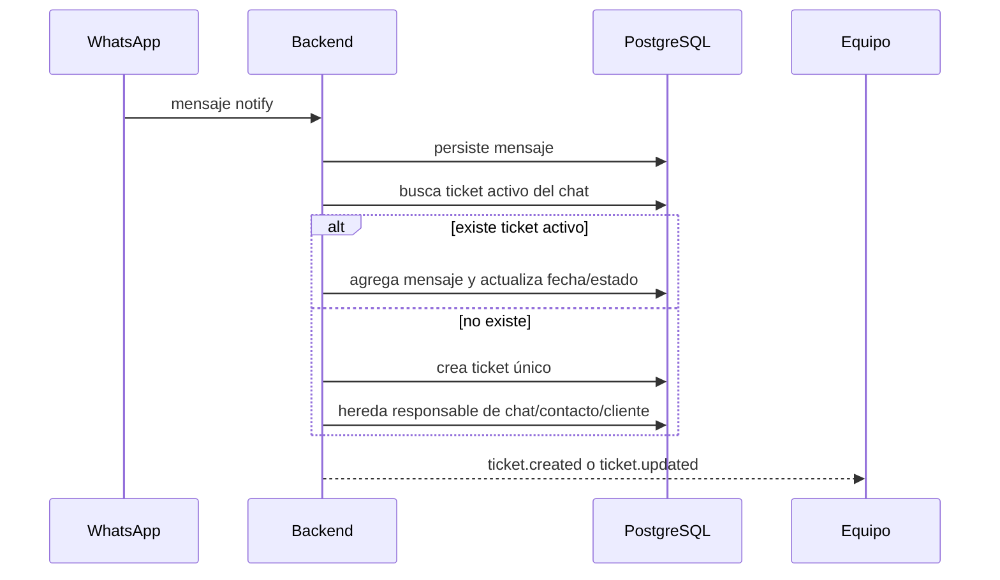

# Tickets y WhatsApp

## Bandejas

- **Libres:** tickets activos sin responsable.
- **Míos:** tickets asignados a la persona autenticada.
- **Todos:** disponible para owner/admin.

Estados: `NEW`, `OPEN`, `WAITING_CUSTOMER`, `RESOLVED`, `CLOSED`. Prioridades: baja, normal, alta y urgente.

## Flujo entrante

## Reglas

- Se ignoran grupos para tickets contables.
- Historial importado no abre tickets; sólo mensajes nuevos de tipo `notify`.
- Un nuevo mensaje reabre de “esperando cliente”, “resuelto” o “cerrado” a “abierto”.
- Resolver o cerrar conserva la clave activa para mantener un único ticket por conversación.
- La respuesta del ticket usa el runtime real de WhatsApp y luego vincula el mensaje enviado.
- Los mensajes enviados desde el teléfono vinculado se incorporan al ticket activo.
- Comentarios internos no se envían al cliente.
- Cada asignación, estado, comentario y mensaje relevante crea auditoría.

## Operación diaria

1. Verificar el indicador de conexión en Atención al cliente.
2. Tomar un ticket libre antes de responder.
3. Vincular contacto y cliente cuando corresponda.
4. Usar “Esperando cliente” cuando falta una respuesta externa.
5. Cerrar al terminar; si el cliente vuelve a escribir, el mismo ticket se reabre automáticamente.

> [!warning]
> El QR necesita una persona presente. La carpeta de autenticación de WhatsApp es un secreto operativo y sólo se respalda cifrada o en almacenamiento controlado.
