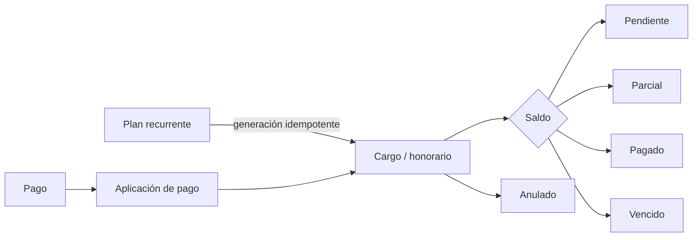

# Cobranzas

Relacionado con [[03 - Modelo de datos]] y [[07 - Clientes y checklists]].

## Cuenta corriente

- PYG es la moneda predeterminada.
- USD u otras monedas se muestran en líneas independientes.
- `saldo = importe - pagos aplicados`; no se calcula con `number` en la capa de datos.
- Un pago no puede aplicarse por encima del saldo del cargo ni por encima del total disponible del pago.
- Miembros registran movimientos de clientes propios.
- Sólo owner/admin importan, anulan o corrigen movimientos contabilizados.

## Importación Excel/CSV

1. Subir `.xlsx` o `.csv`.
2. Recibir vista previa con errores por fila.
3. Corregir RUC, moneda, importe, fecha, duplicados o responsable.
4. Confirmar únicamente cuando todas las filas sean válidas.
5. Conservar el resumen de resultado; el archivo original no contiene credenciales.

La detección de duplicados usa claves externas y datos del movimiento. Una confirmación repetida debe ser segura.

## Vencimientos

Los estados vencidos se calculan contra `America/Asuncion`. La pantalla Inicio muestra vencidos y saldos agrupados por responsable y moneda.
