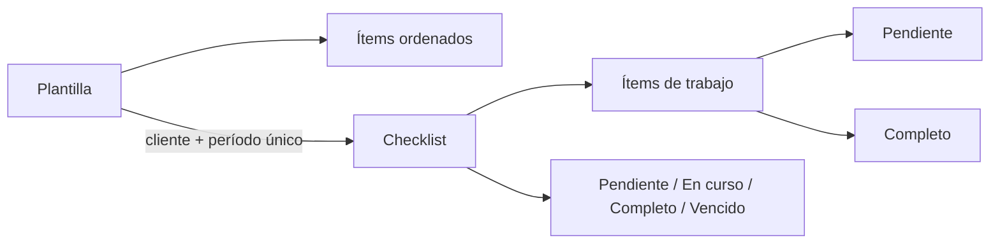

# Clientes y checklists

## Datos del cliente

- Tipo: persona física o jurídica.
- RUC y DV separados.
- Razón social y nombre comercial.
- Actividad, obligaciones tributarias configurables y domicilio.
- Contactos, teléfonos y chats vinculados.
- Responsable principal y colaboradores por área.
- Estado: prospecto, activo, inactivo o suspendido.

La plataforma ayuda a ordenar información; no valida contra DNIT ni Marangatu. No guardar contraseñas tributarias.

## Checklists por período

- Periodicidad mensual, trimestral, anual o a demanda.
- Unicidad por cliente, plantilla y `periodKey` evita duplicados.
- Cada ítem conserva responsable de finalización, fecha y notas.
- Sólo owner/admin crean y mantienen plantillas.
- Member opera checklists de su cartera; viewer sólo consulta.

## Documentos

Los metadatos viven en PostgreSQL y el binario en almacenamiento protegido. Toda descarga debe comprobar workspace y acceso al cliente. No exponer rutas físicas ni permitir archivos ejecutables.
