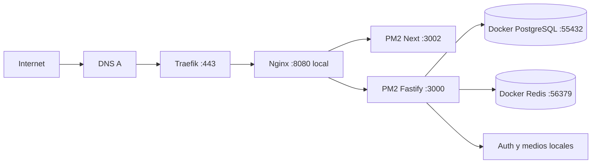

# Despliegue

Producción canónica: `https://romez.consultoriadigital.io`.

## Reglas

- Un solo proceso PM2 de backend por el estado compartido de WhatsApp.
- PM2 y ambos procesos corren como usuario Unix dedicado `romez`, nunca como `root`.
- Backend y frontend PM2 escuchan exclusivamente en `127.0.0.1`.
- PostgreSQL y Redis dedicados en Docker, enlazados sólo a loopback.
- Redis exige contraseña local y AOF; `REDIS_URL` lleva un secreto URL-safe.
- Nginx escucha sólo en loopback y en el gateway privado de Traefik; desactiva buffering y amplía timeout en eventos WhatsApp.
- El drop-in `ops/systemd/nginx-romez.conf` ordena Nginx después de Docker; el preflight debe confirmar `172.18.0.1` antes de habilitar el vhost.
- `ops/logrotate/romez` evita que los logs del PM2 dedicado crezcan sin límite.
- Traefik emite y renueva HTTPS.
- El puerto `8080` no queda público después de validar el dominio.
- Los contenedores de aplicación incompletos se retiran únicamente tras validar PM2.

## Orden de publicación

1. Completar [[09 - Respaldo y restauracion]].
2. Instalar exactamente con `pnpm --frozen-lockfile`.
3. Levantar PostgreSQL/Redis dedicados.
4. Aplicar `prisma migrate deploy` sobre la base limpia.
5. Ejecutar bootstrap con `ROMEZ_OWNER_*`.
6. Compilar backend y frontend con URL pública de API.
7. Crear/verificar el usuario de servicio `romez`, darle sólo lectura del release y escritura sobre `.data`; ejecutar su propia instancia PM2.
8. Detener sin borrar sólo los procesos CRM del PM2 root, cargar `ops/pm2/ecosystem.config.cjs` como `romez` y validar `/health`; reiniciar los anteriores si falla.
9. Instalar Nginx/Traefik, validar configuración y DNS.
10. Probar HTTPS, login y roles.
11. Reconectar WhatsApp por QR y realizar envío/recepción real.

Las variables reales sólo viven en archivos protegidos del VPS. Ver `ops/production.env.example` para nombres sin valores.
Para el owner, preferir `ops/scripts/bootstrap-owner.sh`: solicita la clave sin mostrarla y sólo la exporta durante el proceso de bootstrap.
