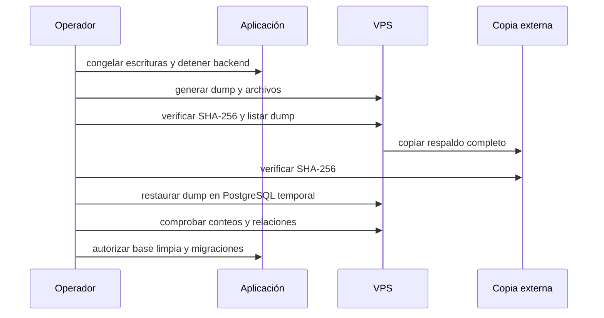

# Respaldo y restauración

El reinicio productivo sólo puede comenzar después de verificar dos copias y una restauración temporal.

## Contenido obligatorio

- Dump PostgreSQL en formato custom.
- Archivo de autenticación WhatsApp.
- Medios WhatsApp y documentos protegidos de clientes.
- Manifiesto de configuración con nombres de variables y valores redactados.
- `SHA256SUMS`.
- Segunda copia fuera del VPS.

## Procedimiento

## Criterios de restauración

- El dump abre con `pg_restore --list`.
- Los hashes coinciden en VPS y copia externa.
- La restauración temporal termina sin errores.
- Se validan conteos de usuarios, espacios, contactos, oportunidades, chats y mensajes.
- Los archivos comprimidos pasan prueba de integridad.

> [!danger]
> No borrar el respaldo ni la base anterior sin autorización explícita. No imprimir `DATABASE_URL`, tokens, contraseñas ni contenido de `.env` en logs.

> [!warning]
> El snapshot pre-reset está verificado, pero la copia diaria cifrada fuera del VPS todavía requiere definir un destino externo y su política. No configurar borrado o retención destructiva sin autorización explícita.

Scripts: `ops/scripts/backup-production.sh`, `ops/scripts/verify-backup.sh`, `ops/scripts/test-restore.sh` y `ops/scripts/test-migrations.sh`.

## Última ejecución verificada

- Canonical: `/var/www/crm/backups/romez-pre-reset-20260830T020857Z`.
- SHA-256 correcto tanto en VPS como en la copia externa.
- Dump restaurado en PostgreSQL 16 temporal y conteos comparados.
- Autenticación, medios y documentos extraídos temporalmente y comparados por cantidad y bytes.
- La aplicación anterior volvió a quedar en línea después de la ventana de respaldo.
